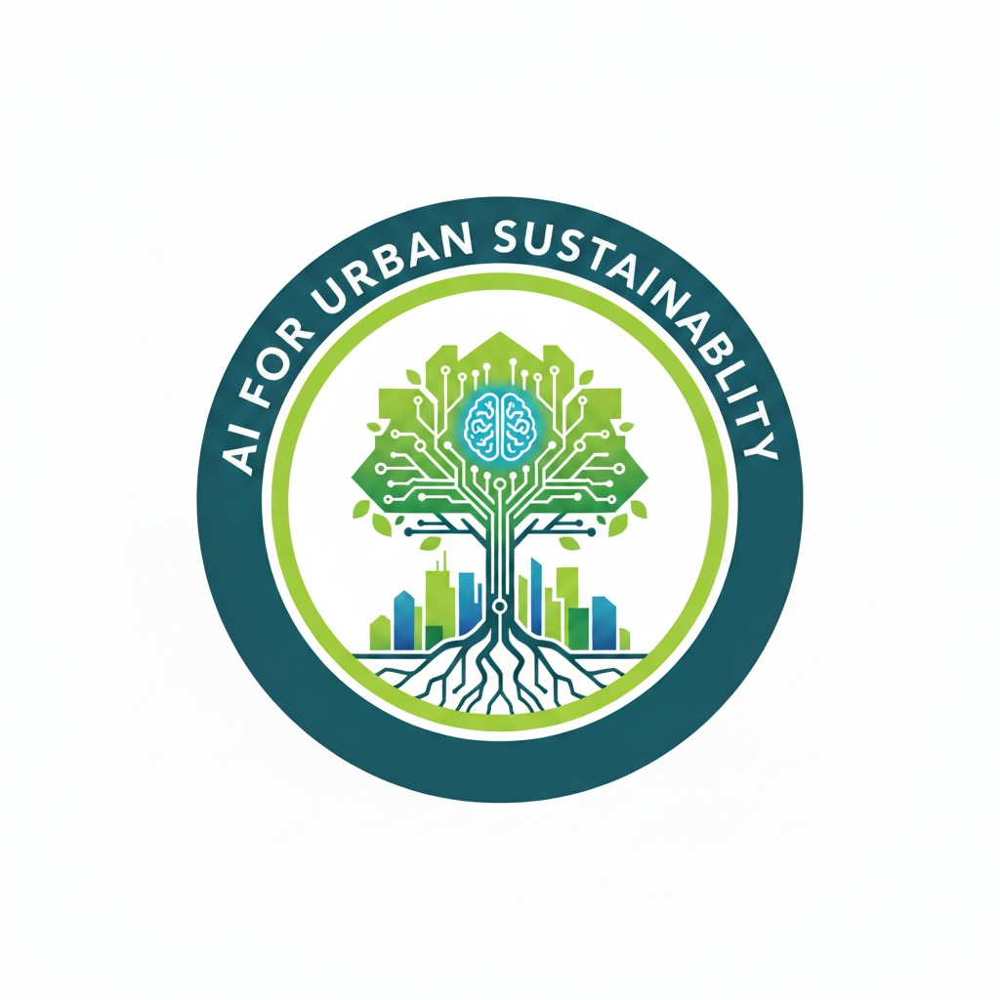

  
  <h1 style="margin: 0;">AI for Urban Sustainability</h1>

The rapidly growing urban populations around the world demand innovative solutions to ensure cities remain resilient, sustainable, and livable. This course, <strong>AI for Urban Sustainability</strong>, is designed to equip students with cutting-edge techniques in urban analytics, spatial data science, and deep learning, with a focus on addressing the environmental, social, and economic challenges faced by cities.
The rapidly growing urban populations around the world demand innovative solutions to ensure cities remain resilient, sustainable, and livable. This course, *AI for Urban Sustainability*, is designed to equip students with cutting-edge techniques in urban analytics, spatial data science, and deep learning, with a focus on addressing the environmental, social, and economic challenges faced by cities.

In the face of rapid urbanization and the growing impacts of climate change, cities around the world are under increasing pressure to become more sustainable, resilient, and equitable. AI for Urban Sustainability is a forward-looking course that explores the transformative role of artificial intelligence in tackling these urban challenges. Designed for students and professionals interested in leveraging advanced technologies to shape the cities of tomorrow, this course offers a comprehensive overview of how AI can drive sustainable urban development.

### Key topics covered:
- Urban Analytics: Understand the complexities of urban systems and how AI can help analyze, optimize, and improve city planning, mobility, and infrastructure development.
- Spatial Data Science: Learn to work with geospatial data, including remote sensing data, street-level images, and digital maps, to analyze urban landscapes and phenomena.
- Machine learning: Apply advanced machine learning techniques to urban data for tasks such as land use classification, predictive modeling, and extracting valuable insights from satellite and street-level imagery.
- Cases studies: using AI for different urban applications.

### Lab 1. Basics of Python programming
- install Anaconda ([link](lab1-basics-python-spatial-programing/install-anaconda.md))
- configure the Jupyter notebook notebook ([link](lab1-basics-python-spatial-programing/jupyter-notebook.md))
- data structures, loops, read and write txt files ([link](lab1-basics-python-spatial-programing/Python-basics.ipynb))

### Lab 2. Vector Data operations
We will use `geopandas`, `fiona`, `shapely` for conducting the spatial analysis on shapefile. All the required files are ([here](lab2-vector-data-manipulation/data.zip)). Please download it and unzip to your lab2 working directory with your script. 
- Read write shapefile using `geopandas` ([link](lab2-vector-data-manipulation/1.%20geopandas-spatial-analysis.ipynb))
- Combination of `fiona` and `shapely` for shapefile operations ([link](lab2-vector-data-manipulation/2.%20fiona-shapefile.ipynb))
- Advanced analysis of features, `intersects`, `rtree` ([link](lab2-vector-data-manipulation/3.%20advanced_analysis_fiona_shapely.ipynb))

### Lab 3. Raster data operations
- download nationally availalbe aerial imagery ([link](lab3-raster-data-manipulation/1.%20naip-downloader.ipynb))
- raster data manipulation, `read`, `write`, and `display` raster data ([link](lab3-raster-data-manipulation/2.%20raster-data-manipulation.ipynb)).
- `clip`, `mosaic`, and `zonal` analysis ([link](lab3-raster-data-manipulation/3.clip-mosaic-zonal-analysis.ipynb)).

### Lab 4. Urban flood mapping using DEM
- Download `DEM` files automatically ([link](lab4-urban-flood-mapping/download-dem.ipynb))
- Run `HAND` model to estimate potential flooding ([link](lab4-urban-flood-mapping/urban-flood-vulnerability.ipynb))

### Lab 5. GPU programming for shade mapping
- Setup the PyCUDA environment
- Write your very first CUDA code
- Map the shade distribution based on DSM

### Lab 6. Basics of machine learing
- familiar with `scikit` for machine learning algorithms ([link](lab6-machine-learning/MachineLearning_GettingStarted.ipynb))
- land use/cover mapping on the NAIP images ([link](lab6-machine-learning/machine-learning-land-cover-mapping-penn.ipynb))

### Lab 7. Deep neural network (on Co-lab)
- Deep neural network for regression problem
- Building convolution neural network for image classification

### Lab 8. Mask-RCNN for object detection
- familiar with the Mask-RCNN model for object detection
- create your own labels data using `labelme` tool
- fine-tune the Mask-RCNN model for new object detection

### Lab 9. Build a UNet for building extraction
- prepare the datasets for the CNN model ([link](lab8-unet/1.data-preparation.ipynb))
- train your CNN model for building detection ([link](lab8-unet/2.model-trainning-prediction.ipynb))

### Lab 10. Image segmentation on street-level image

- prepare the street-level image
- fork the PSPNet for the image segmentation
- create map based on the segmented image and the metadata

### Lab 11. LLMS for Urban Planning