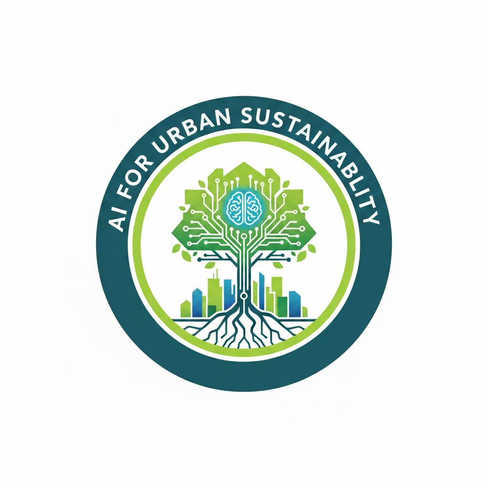

<div align="center">
  

# AI for Urban Sustainability

### Spatial data science, machine learning, and deep learning for more resilient cities

[](#course-materials)
[](https://www.python.org/)
[](https://jupyter.org/)
[](env.yml)

</div>

---

## About the course

Cities face growing environmental, social, and economic pressures—from climate change and rapid urbanization to mobility, infrastructure, and equity challenges. **AI for Urban Sustainability** explores how artificial intelligence and spatial data science can help us understand these complex systems and design more sustainable, resilient, and livable cities.

Through hands-on notebooks and applied case studies, students work with geospatial data, remote sensing imagery, street-level images, and urban datasets. The course progresses from Python and spatial analysis fundamentals to GPU computing, machine learning, computer vision, and large language models.

## What you will learn

- Analyze urban systems using vector, raster, and remote-sensing data
- Build reproducible spatial workflows with Python and Jupyter
- Apply machine-learning methods to land-use and land-cover mapping
- Develop deep-learning models for object detection and image segmentation
- Use GPU computing for high-performance urban analysis
- Explore practical applications of large language models in urban research

## Technology stack

`Python` · `GeoPandas` · `Fiona` · `Shapely` · `Rasterio` · `GDAL` · `scikit-learn` · `PyCUDA` · `Jupyter`

## Getting started

1. Clone this repository:

   ```bash
   git clone https://github.com/xiaojianggis/ai-urban-sustainability.git
   cd ai-urban-sustainability
   ```

2. Create and activate the course environment:

   ```bash
   conda env create -f env.yml
   conda activate geospatial
   ```

3. Start JupyterLab:

   ```bash
   jupyter lab
   ```

New to the setup process? See the guides for [installing Anaconda](lab1-basics-python-spatial-programing/install-anaconda.md) and [configuring Jupyter Notebook](lab1-basics-python-spatial-programing/jupyter-notebook.md).

## Course materials

| Lab | Theme | Core concepts |
|:---:|---|---|
| 01 | [Python programming](#lab-01--python-programming-fundamentals) | Data structures, loops, and file I/O |
| 02 | [Vector data](#lab-02--vector-data-operations) | GeoPandas, Fiona, Shapely, and spatial relationships |
| 03 | [Raster data](#lab-03--raster-data-operations) | NAIP imagery, clipping, mosaicking, and zonal analysis |
| 04 | [Urban flood mapping](#lab-04--urban-flood-mapping-with-dems) | Digital elevation models and HAND |
| 05 | [GPU programming](#lab-05--gpu-programming-for-shade-mapping) | PyCUDA and urban shade modeling |
| 06 | [Machine learning](#lab-06--machine-learning-fundamentals) | scikit-learn and land-cover classification |
| 07 | [Deep neural networks](#lab-07--deep-neural-networks) | Regression and convolutional neural networks |
| 08 | [Object detection](#lab-08--mask-r-cnn-for-object-detection) | Mask R-CNN, LabelMe, and fine-tuning |
| 09 | [Building extraction](#lab-09--u-net-for-building-extraction) | Dataset preparation, U-Net training, and prediction |
| 10 | [Street-level imagery](#lab-10--street-level-image-segmentation) | PSPNet, semantic segmentation, and mapping |
| 11 | [Large language models](#lab-11--large-language-models) | Text and image analysis with the OpenAI API |

### Lab 01 · Python programming fundamentals

- [Install Anaconda](lab1-basics-python-spatial-programing/install-anaconda.md)
- [Configure Jupyter Notebook](lab1-basics-python-spatial-programing/jupyter-notebook.md)
- [Practice data structures, loops, and text-file I/O](lab1-basics-python-spatial-programing/Python-basics.ipynb)

### Lab 02 · Vector data operations

Use GeoPandas, Fiona, and Shapely to conduct spatial analysis with shapefiles. Download the [complete lab dataset](lab2-vector-data-manipulation/data.zip), then extract it into your Lab 02 working directory.

- [Read, write, and analyze shapefiles with GeoPandas](lab2-vector-data-manipulation/1.%20geopandas-spatial-analysis.ipynb)
- [Work with shapefiles using Fiona and Shapely](lab2-vector-data-manipulation/2.%20fiona-shapefile.ipynb)
- [Perform advanced feature, intersection, and spatial-index analysis](lab2-vector-data-manipulation/3.%20advanced_analysis_fiona_shapely.ipynb)

### Lab 03 · Raster data operations

- [Download nationally available aerial imagery](lab3-raster-data-manipulation/1.%20naip-downloader.ipynb)
- [Read, write, display, and manipulate raster data](lab3-raster-data-manipulation/2.%20raster-data-manipulation.ipynb)
- [Run clipping, mosaicking, and zonal analysis workflows](lab3-raster-data-manipulation/3.clip-mosaic-zonal-analysis.ipynb)

### Lab 04 · Urban flood mapping with DEMs

- [Download digital elevation model data automatically](lab4-urban-flood-mapping/download-dem.ipynb)
- [Estimate potential flooding with the HAND model](lab4-urban-flood-mapping/urban-flood-vulnerability.ipynb)

### Lab 05 · GPU programming for shade mapping

- [Set up PyCUDA and write your first CUDA program](https://colab.research.google.com/drive/1l9qMxAMcQ9pu-pqX6SUevNnK9kmFMzeH)
- [Map shade distribution from a digital surface model](https://colab.research.google.com/drive/1hFVFv5qaKtzUhuFj9MSlp3odBuKTwQoP)

### Lab 06 · Machine learning fundamentals

- [Get started with machine learning in scikit-learn](lab6-machine-learning/MachineLearning_GettingStarted.ipynb)
- [Map land use and land cover from NAIP imagery](lab6-machine-learning/machine-learning-land-cover-mapping-penn.ipynb)

### Lab 07 · Deep neural networks

These exercises run in Google Colab.

- [Build a deep neural network for regression](https://colab.research.google.com/drive/1GxjaO93_lWo433GFk4hDNE4ebCKhFZ_7)
- [Build a convolutional neural network for image classification](https://colab.research.google.com/drive/1S9GDD1vCLVTzVuQsnWO1jyI5rIjx8ktK)

### Lab 08 · Mask R-CNN for object detection

- Become familiar with the Mask R-CNN object-detection architecture
- Create custom labeled data with LabelMe
- Fine-tune Mask R-CNN for a new detection task

### Lab 09 · U-Net for building extraction

- [Prepare training datasets for the convolutional neural network](lab8-unet/1.data-preparation.ipynb)
- [Train the model and generate building predictions](lab8-unet/2.model-trainning-prediction.ipynb)

> **Repository note:** The Lab 09 materials are currently stored in the `lab8-unet` directory.

### Lab 10 · Street-level image segmentation

- Prepare street-level imagery for analysis
- Adapt PSPNet for semantic segmentation
- Create maps from segmented imagery and associated metadata

### Lab 11 · Large language models

- Explore large language models and their urban applications
- [Use the OpenAI API for text and image analysis](lab11-llms/openai-llm.ipynb)

---

## Repository structure

```text
ai-urban-sustainability/
├── lab1-basics-python-spatial-programing/
├── lab2-vector-data-manipulation/
├── lab3-raster-data-manipulation/
├── lab4-urban-flood-mapping/
├── lab6-machine-learning/
├── lab8-unet/
├── lab11-llms/
├── env.yml
└── README.md
```

## Using these materials

Each lab is designed as a practical, notebook-based exercise. Open the linked notebook, read the setup notes, and keep its supporting data in the same lab directory unless the instructions specify otherwise. Google Colab links are provided for exercises that benefit from hosted GPU resources.

<div align="center">
  <sub>AI for Urban Sustainability · University of Pennsylvania</sub>
</div>
